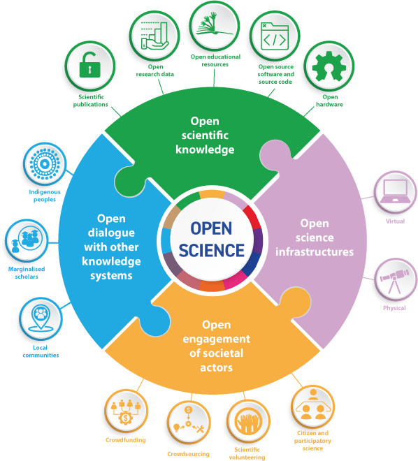

# Open Science @ UTBM

*As open as possible, as closed as necessary.*

## What is Open Science?

according to UNESCO (c.f. [Recommendation on Open Science 2021](https://unesdoc.unesco.org/ark:/48223/pf0000383323)), four key pillars of openness:
* open scientific knowledge;
* open science infrastructures;
* open engagement of societal actors; and,
* open dialogue with other knowledge systems.

## Why Open Science?

* Open science promotes a more accurate verification of scientific results.
* Open science reduces duplication in collecting, creating, transferring and re-using scientific material.
* Open science increases productivity in an era of tight budgets.
* Open science results in great innovation potential and increased consumer choice from public research.
* Open science promotes citizens’ trust in science.

*Source of text: OECD*

## How to implement Open Science (by example)?

For example, for *open scientific knowledge*, one could:
* make scientific papers open access (e.g. [here](https://scholar.google.com/citations?user=D1x7Hd8AAAAJ));
* open research data (e.g. [here](https://yzrobot.github.io/#Research));
* open educational resources (e.g. [here](https://yzrobot.github.io/introduction_to_mobile_robotics/));
* open software and source code (e.g. [here](https://github.com/yzrobot)); and,
* open hardware (e.g. [here](https://github.com/Nedzhaken/human_aware_navigation)).

Another cool initiative: 

## UTBM in action

* [UTBM Portal on **HAL**](https://hal.science/)
* [UTBM Portal on **Recherche Data Gouv**](https://recherche.data.gouv.fr/en)
* [UTBM Portal on **dat@UBFC**](https://search-data.ubfc.fr/)

## Doctoral training programs @ UBFC

* [MOOC Science ouverte](https://adum.fr/script/formations.pl?mod=3494499)
* [Déposer dans HAL](https://adum.fr/script/formations.pl?mod=3490888)
* [L'identité numérique du chercheur](https://adum.fr/script/formations.pl?mod=3490842)
* [Rédiger un DMP](https://adum.fr/script/formations.pl?mod=415727)
* [Déposer dans HAL (3eme session)](https://adum.fr/script/formations.pl?mod=3490034)

## Major events

* [Open Science European Conference (OSEC)](https://osec2022.eu/), Paris, France, 4-5 February 2022.
